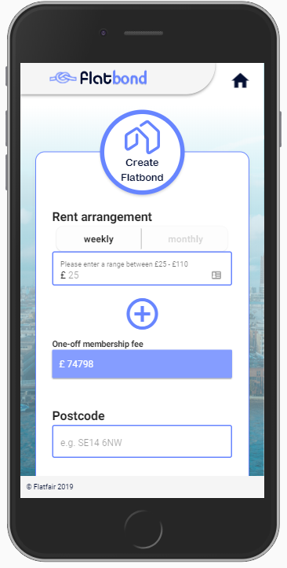
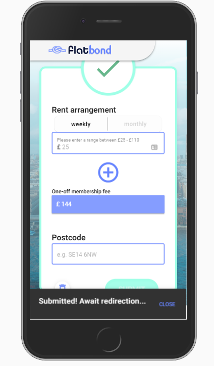
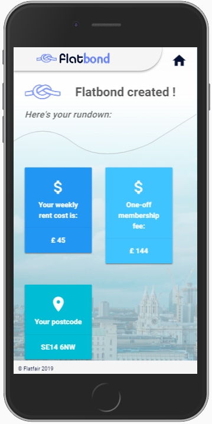

# Flatfair frontend challenge
**FLATBOND: Nuxt/Vue.js-based web app prototype made as part of the recrutation frontend challenge.**
<br>
**WEBSITE URL: https://flatbond.firebaseapp.com**
----- 
# App gallery: 


      

## Build Setup

``` bash
# install dependencies
$ npm install

# serve with hot reload at localhost:3000
$ npm run dev

# build for production and launch server
$ npm run build
$ npm start

# generate static project to be served on static CDNs like firebase hosting
$ npm run generate
```

For detailed explanation on how things work, checkout [Nuxt.js docs](https://nuxtjs.org).

## Application's full documentation 
Please feel encouraged to inspect the commit logs history. 
I was creating this project/website in such a way to ensure 
the commit logs show a clear and logical structure and fully
explain all the bits and bobs happening in the project.
In case you wonder how come the commits are kinda 'flawless' 
(i.e. no 'work-in-progress' commits or any of that sort), I 
was using the https://www.sourcetreeapp.com/ to cherry-pick 
the progress to commit only after already  creating each bigger 
section of work (vuex store, layout page, index page etc.). 
I believe it to be easier to inspect the commit logs this way 
for the repo reader :) 
Also NOTE: as you can see by the gallery, I was focused on 
making the website in the mobile-first approach.

### _Notable commit logs (but there's more if you're interested_ :)) : 
- COMMIT LABEL: (Creating layout page #3): Using SCSS and BEM 
- COMMIT LABELS: (Creating layout page #5-11): Creating topbar logo animation
- COMMIT LABEL: (Creating layout page #14): Explanation regarding the "!important" css properties in the project.
- COMMIT LABEL: (FINAL: Creating layout page #16): Info about potential future image optimisation 
- COMMIT LABEL: (Creating Vuex store #1): Creating vuex state variables. 
- COMMIT LABEL: (Creating Vuex store #4): Description of the "setInfoAboutFixedMembershipFee" mutation. 
- COMMIT LABEL: (Creating Vuex store #5): Description of the "getFixedMembershipInfo" mutation. 
- COMMIT LABEL: (Creating Vuex store #7): Description of the "setFlatbondDetails" mutation. 
- COMMIT LABEL: (Creating Vuex store #8): Description of the "submitFlatbondForm" mutation. 
- COMMIT LABEL: (Creating first page #4) I described the "chooseBoxBtnClicked" method which handles the correct logic for choosing the "weekly" or "monthly" rent arrangement in the form.
- COMMIT LABEL: (Creating first page #5) method for clearing the form.
- **COMMIT LABEL: (Creating first page #6) description of "submitFlatbondForm" method**
- COMMIT LABEL: (Creating first page #8) description of the "membershipFee" computed property.
- **COMMIT LABEL: (MAJOR: Creating first page #10) A thorough description of the markup for the form.** (NB I feel this commit should be chunked down now when I look at it ...)
- COMMIT LABEL: (Creating details page #16) regarding a mistake in labelling the commits for the "detailed page" progress ... (routine kills one's focus and a correctness .. :> )  
- OTHER


## Future improvements: 
- I regret not having time to write some proper unit tests. As you can see I set up the testing with the initial project's setup but never managed to get to it 
- I should have also spend some time tinkering with the ESlint config so that it matches my style but ultimately decided there are more important matters in the project for the time being (plus I use prettier which I have configured to my liking so at least formatting-wise the code is consistent :) )  
- I would look for a different way of appending the svg "wavey" shape at the top in the background of the details page. Currently it might go south in displaying on big viewports.
- To quicken the dev I decided to go with a "simple" rotation animation but your Flatfair home logo just asks itself to have some cool SVG morphing animation (e.g. the home shape nicely morphing/transitioning to a success-tick shape ;) )
- I decided to abandon the idea of a menu which you can see in the initial Adobe XD mockups just because it didn't seem to make that much sense anyway (and I wasn't particularly happy on it's look as well..) 
- Page transitions ! If I wasn't already heavily exceeding the estimated worktime for this challenge I would have tinker with making a nice page transition to the details page, which is rather easy to do in Vue [pointing to the awesome Sarah Drasner's animation conf talks and hoping she'll come to vue-london meetups to do workshops on it at some point]    
- I ended up not really needing/using the "isLoading" comp. prop but all the set up for it is already made in vuex and the only thing's missin is just a <v-progress-circular> component on the website; if you want to how would that look like, it's quite commonly used by me in my other github vue projects.
- In the initial setup I added the out-of-the-box PWA basic support, so if there's a need for that one could easily start tinkering with the Service Worker.js, maybe add the Google's "Workbox" to speed dev time on it and just add them-nice-nearly-native-features to the project ! ;)  
- The twitter card full implementation with Twitter API, a small teaser of which I added to this project :). 
- Configure the webpack further than what comes out-of-the-box with the Nuxt starter template and especially optimise it for using the .webp images usage.
- Speaking of the images - handle the proper ":srcset" (in template)/@media queries (in css) so that we don't load those big-sized image on all the viewports but rather a smaller one for smaller devices. Also remove the 'directly linked' image on the twitter card and add a proper .webp image for it.   
- I could change the favicon to your flatfair logo home just as you do on your homepage ;) .
- I could've used the Repo's WIKI section instead of making this huge README but this way you have it all laid out at forefront without too much navigating around. 
  
- Oh, also, there's a small console warning about the "tapable.js being deprecated" during the 'npm run dev' which is promised by Alex Lichter from Nuxt team to be tackled in the next update on this thread https://github.com/nuxt-community/pwa-module/issues/120. The Nuxt v.2.4.0 update happened to be rolled-out yesterday so there's another potential thing to do to check if that's indeed the case ;)   
